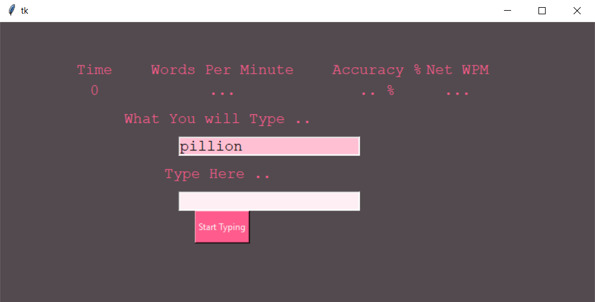
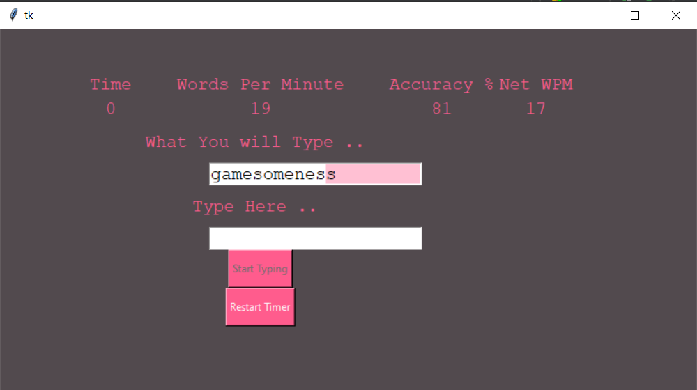

# Desktop App Measure Your Typing Speed

### This is a desktop app that calculates your typing wpm, accuracy, and Net wmp.

## Explanation
* prompt the user to write a word.
* words are from the API ,and they are random words. The API used https://random-word-api.herokuapp.com/home
* after a minute the wpm and accuracy are calculated.
* the user can restart the timer after the round has finished.

## UI

## Rana Hafez(2022)